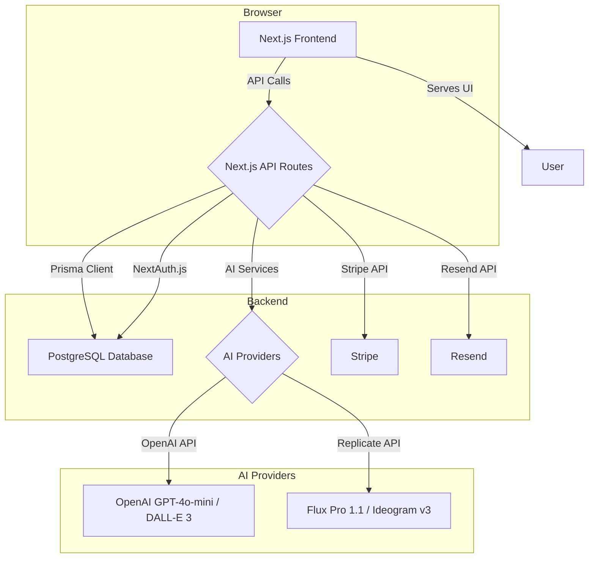

# Social Echo - Complete Production Blueprint
**Version:** 12.3  
**Date:** November 7, 2025  
**Author:** Manus AI

---

## 1. Project Overview

**Social Echo** is an AI-powered LinkedIn content generator designed for SMEs. The core value proposition is to allow users to train their "ECHO" (a personalized AI profile) once, and then generate high-quality, relevant LinkedIn posts and accompanying images in under 10 minutes per day. The platform is built with a focus on ease of use, personalization, and industry-specific content relevance.

### 1.1. Core Features

- **AI Profile Training:** Users define their business, industry, target audience, tone of voice, and keywords.
- **Personalized Content Generation:** Creates LinkedIn posts tailored to the user's profile.
- **Multi-Provider Image Generation:** Generates scroll-stopping visuals using a mix of DALL-E 3, Flux Pro 1.1, and Ideogram v3 Turbo.
- **RSS-Powered News Content:** Automatically discovers and pulls from industry-specific news feeds for timely, relevant content.
- **Content Planner:** Allows users to schedule different types of content for each day of the week.
- **Feedback Loop:** Users can rate generated content (Good/Needs Work) to improve the AI's performance over time.
- **Admin & Agency Features:** Includes capabilities for user management, impersonation, and white-labeling for agencies.

---

## 2. Technical Architecture

Social Echo is a modern full-stack web application built on the Next.js framework, deployed on Render.

### 2.1. Tech Stack

| Category      | Technology                                       |
|---------------|--------------------------------------------------|
| **Framework**   | Next.js 14 (with App Router)                     |
| **Language**    | TypeScript                                       |
| **Database**    | PostgreSQL                                       |
| **ORM**         | Prisma                                           |
| **Styling**     | Tailwind CSS                                     |
| **Auth**        | NextAuth.js (Credentials Provider)               |
| **Deployment**  | Render                                           |
| **Text AI**     | OpenAI GPT-4o-mini                               |
| **Image AI**    | DALL-E 3, Flux Pro 1.1, Ideogram v3 Turbo (via Replicate) |
| **Payments**    | Stripe                                           |
| **Email**       | Resend                                           |

### 2.2. System Design



### 2.3. Directory Structure

```
social-echo/
├── app/                    # Next.js App Router pages & API routes
│   ├── dashboard/         # Main user dashboard
│   ├── train/             # Profile training page
│   └── api/               # All backend API logic
├── components/            # Shared React components
│   ├── ui/                # Base UI elements (Button, Card, etc.)
│   └── *.tsx              # Feature-specific components
├── lib/                   # Core business logic & utilities
│   ├── ai/                # AI service integration & prompt building
│   ├── billing/           # Stripe integration logic
│   ├── email/             # Resend email service
│   ├── news/              # RSS feed processing
│   └── prisma.ts          # Prisma client instance
├── prisma/                # Database schema and migrations
│   └── schema.prisma      # The single source of truth for the database
└── public/                # Static assets
```

---

## 3. Key Features & Implementation

### 3.1. News Content Generation (RSS-Focused)

This system was recently overhauled to solve the critical issue of irrelevant news content.

**How it Works:**
1.  **Automatic RSS Discovery:** When a user saves their profile, the system checks if they have any custom RSS feeds. If not, it uses `lib/industry-rss-feeds.ts` to find relevant feeds based on their industry and automatically adds them to their profile.
2.  **90% RSS Priority:** When generating a "News" post, the AI service (`lib/ai/ai-service-v8.8.ts`) now has a 90% probability of using content from the user's RSS feeds.
3.  **Content Fetching:** The `rss-parser` library is used to fetch and parse the latest articles from the selected RSS feeds.
4.  **AI Summarization & Analysis:** The headlines and content from the RSS feeds are passed to the GPT-4o-mini model, which is prompted to analyze the news from the perspective of the user's business and industry.
5.  **Source Attribution:** The AI prompt in `lib/ai/prompt-builder.ts` explicitly instructs the model to cite the source of the news (e.g., "According to Asset Finance Connect...").

**Files of Interest:**
-   `lib/industry-rss-feeds.ts`: The mapping of industries to default RSS feeds.
-   `app/api/profile/route.ts`: Contains the logic to auto-populate feeds on profile save.
-   `lib/ai/ai-service-v8.8.ts`: Sets the 90% probability for using the RSS service.
-   `lib/news/enhanced-news-service.ts`: The core service for fetching and processing RSS content.

### 3.2. Multi-Provider Image Generation

To improve image quality, the system was updated to use specialized image generators for different visual styles.

**Routing Logic (`app/api/generate-image/route.ts`):**
-   If `style` is **"Photo-Real"** → Use **Flux Pro 1.1** via Replicate.
-   If `style` is **"Infographic / Data Insight"** → Use **Ideogram v3 Turbo** via Replicate.
-   For all other styles → Use **DALL-E 3** via OpenAI (default).

**Implementation:**
-   A new service `lib/replicate-image.ts` was created to handle all interactions with the Replicate API.
-   The `generate-image` API route contains the primary routing logic.
-   **Fallback Mechanism:** If a Replicate API call fails, the system automatically falls back to using DALL-E 3 to ensure the user always receives an image.
-   The API response now includes a `generator` field to identify which model was used for debugging.

**Status:** ⚠️ **UNVERIFIED.** This integration is blocked by a UI bug that prevents the selection of different visual styles.

### 3.3. Personalization Engine

Personalization is at the heart of Social Echo.

**Key Components:**
1.  **User Profile (`Profile` model):** Stores the user's business name, website, industry, **role/title**, tone of voice, products/services, target audience, USP, and keywords.
2.  **Role Field (Recent Addition):** The `role` field was added to the `Profile` model and the "Train Your Echo" UI to allow for more specific content personalization (e.g., generating content from the perspective of a "CEO" vs. a "Marketing Manager").
3.  **Prompt Engineering (`lib/ai/prompt-builder.ts`):** The user's entire profile is dynamically injected into the system prompts sent to the AI, providing rich context for every generation.

### 3.4. Database Schema (`prisma/schema.prisma`)

The database is structured around a central `User` model with relations to various other data models.

**Core Models:**
-   `User`: Authentication, roles, and core user information.
-   `Profile`: The user's AI training data (industry, role, keywords, etc.).
-   `Subscription`: Stripe subscription status and usage limits.
-   `PostHistory`: A log of all generated posts.
-   `Feedback`: Stores user feedback (Good/Needs Work) on generated posts.
-   `CustomRssFeed`: Stores user-added or auto-populated RSS feeds.
-   `UsageCounter`: Tracks monthly post generation usage.

---

## 4. Current Status & Remaining Issues

### 4.1. Recent Changes (November 7, 2025 Session)

-   **[FIXED]** Critical bug causing irrelevant news content for specialized industries.
-   **[IMPLEMENTED]** RSS-focused news generation with automatic feed discovery.
-   **[IMPLEMENTED]** `role` field for enhanced personalization.
-   **[IMPLEMENTED]** Multi-provider image generation (DALL-E, Flux Pro, Ideogram).
-   **[ATTEMPTED]** Fix for the Visual Style dropdown UI bug.

### 4.2. Known Bugs & Issues

1.  **Visual Style Dropdown Bug (🔴 HIGH PRIORITY):**
    -   **Symptom:** The "Visual Style" dropdown in the image generation panel resets to "Illustration" whenever any other interaction occurs (e.g., clicking the text checkbox, generating an image).
    -   **Impact:** Blocks testing of the Replicate integration and prevents users from selecting their desired visual style.
    -   **Location:** `components/ImagePanel.tsx`.

2.  **Replicate Integration Unverified (⚠️ MEDIUM PRIORITY):**
    -   **Symptom:** Due to the UI bug, it's impossible to test if the routing to Flux Pro and Ideogram is working correctly.
    -   **Impact:** The primary benefit of the new image generators (improved quality) is not being realized.

3.  **Button Text Not Updating (🟡 LOW PRIORITY):**
    -   **Symptom:** The image generation button always says "Generate Illustration" regardless of the selected style.
    -   **Impact:** Minor UX confusion.

---

## 5. Continuation Prompt for New Chat Session

```
**Project:** Social Echo - AI LinkedIn Content Generator
**Objective:** Fix the remaining UI bug and verify the new image generator integration.

**Current State:**
I have just completed a major overhaul of the Social Echo application. The critical issue with irrelevant news content has been solved by implementing an RSS-focused approach with automatic, industry-specific feed discovery. I have also integrated the Replicate API to use Flux Pro 1.1 for photorealistic images and Ideogram v3 Turbo for infographics, with DALL-E 3 as a fallback.

**Remaining Tasks:**

1.  **Fix the Visual Style Dropdown Bug (High Priority):**
    -   The dropdown in `components/ImagePanel.tsx` resets to "Illustration" on any user interaction, which is preventing me from testing the new image generators.
    -   My previous attempt to fix this by adding a `userHasSelectedStyle` state did not work.
    -   **Your task:** Help me diagnose and fix the root cause of this state management issue in the React component.

2.  **Verify the Replicate Integration (Medium Priority):**
    -   Once the UI bug is fixed, I need to perform a comprehensive test of the image generation service.
    -   **Test Plan:**
        -   Generate a "Photo-Real" image and verify (via console logs or API response) that **Flux Pro 1.1** was used.
        -   Generate an "Infographic" image and verify that **Ideogram v3 Turbo** was used.
        -   Generate an "Illustration" and verify that **DALL-E 3** was used.
        -   Test the text checkbox functionality with all styles.
        -   Confirm the image quality has improved as expected.

**Codebase Location:** `/home/ubuntu/social-echo`
**Key Files:**
-   `components/ImagePanel.tsx` (UI Bug Location)
-   `app/api/generate-image/route.ts` (Image Generator Routing Logic)
-   `lib/replicate-image.ts` (Replicate API Service)

Let's start by fixing the UI bug in `ImagePanel.tsx`.
```
